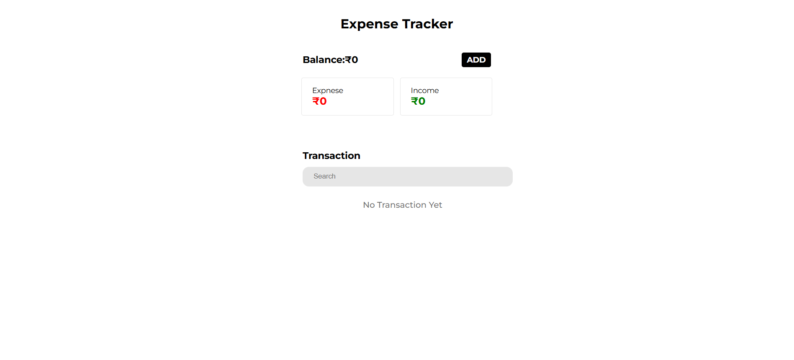
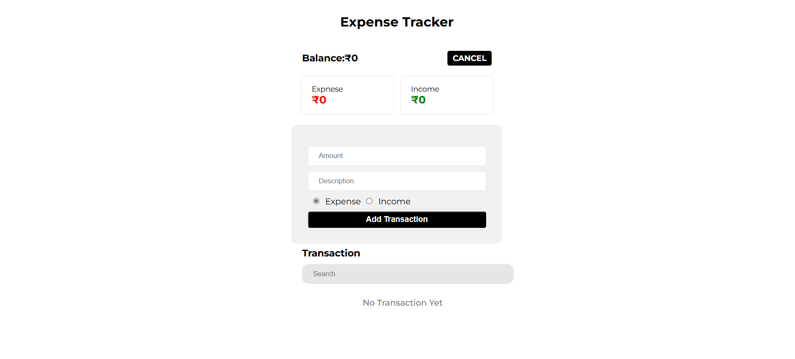
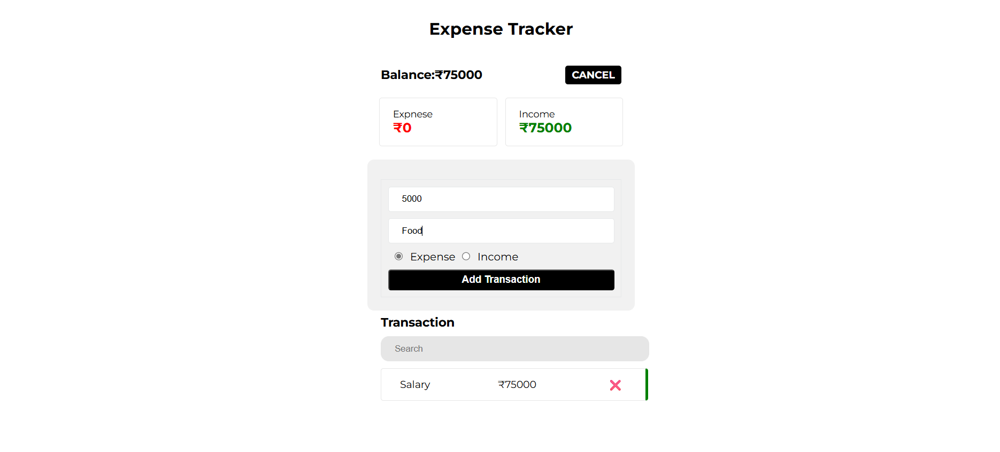
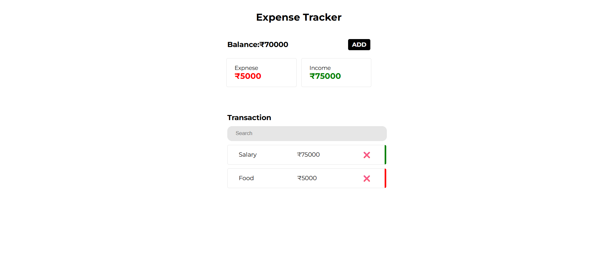

# 💸 Expense Tracker App

A simple and elegant Expense Tracker built with **React** and **styled-components**. It allows users to **add**, **search**, and **delete** income/expense transactions — and it **automatically saves your data to localStorage**, so your data stays even after refreshing the page.

---

## 📸 Demo

> Coming soon – add a link if deployed!

---

## 🚀 Features

- ✅ Add Income or Expense
- ✅ See Real-Time Balance, Income & Expense
- ✅ Search Transactions by Description
- ✅ Delete Transactions
- ✅ Data Persistence with `localStorage`
- ✅ Mobile-friendly UI
- ✅ Built with React + Styled-Components

---

## 🛠️ Technologies Used

- ⚛️ React
- 💅 styled-components
- 🧠 React Hooks (`useState`, `useEffect`)
- 🗂️ localStorage API (for data persistence)

---


## 📸 Screenshots

### 🏠 Starting
 

### 🧾 Expense and Income Form


### ➕ Adding an Expense


### 📊 Overview: Expense, Income, Balance & History



---

## 🧾 Getting Started

Follow these steps to run the project locally:

### 1. Clone the Repository

```bash
git clone https://github.com/safwanmv/expense-tracker-react.git
cd expense-tracker-react
````

### 2. Install Dependencies

```bash
npm install
```

### 3. Run the App

```bash
npm start
```

The app will run on [http://localhost:3000](http://localhost:3000)

---

## 🧠 Project Structure

```plaintext
src/
├── components/
│   ├── HomeComponent.jsx
│   ├── OverViewComponent.jsx
│   └── TransactionComponent.jsx
├── App.js
└── index.js
```

---

## 📂 How LocalStorage Works Here

* On app load: Transactions are loaded from `localStorage`.
* On add/delete: The transaction list is saved again to `localStorage`.
* The data format looks like this:

```json
[
  {
    "desc": "Tea",
    "amount": 20,
    "type": "EXPENSE"
  },
  {
    "desc": "Salary",
    "amount": 5000,
    "type": "INCOME"
  }
]
```

---

## ✨ Future Improvements

* 💾 Export transactions to CSV
* 📈 Graph for expense/income trends
* 🔒 Authentication support
* ☁️ Cloud database instead of localStorage

---

## 🙌 Acknowledgements

Built as part of a React learning journey and inspired by real-world finance tracking needs.

---
